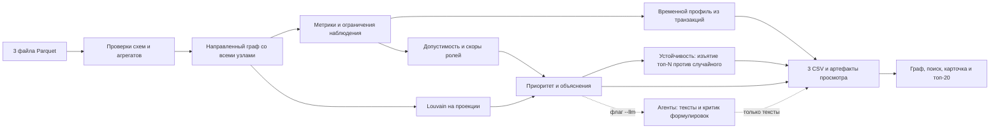

# Граф денег

**Какую задачу решает.** Аналитику финансового мониторинга известен 81 клиент — нижний
уровень цепочки. Наблюдаемая сеть их переводов — 2 248 участников. Вручную он трассирует её
неделями и выбирает, кого проверять, интуитивно.

Инструмент за три секунды строит граф переводов, присваивает каждому из 2 248 участников
роль по документированным правилам, разбивает сеть на группы и выдаёт ранжированный список:
**кого проверять первым и какие именно числа это объясняют**.

На выходе — три CSV для работы и локальный экран со схемой сети, поиском по gid и карточкой
участника. Данные кейса HackAlem AI, июль 2026.

Роли — гипотезы для проверки, а не утверждение о виновности; скоры не являются вероятностью
нарушения. Решение о проверке принимает аналитик.

## Технологии

| Слой | Чем сделано | Зачем именно так |
|---|---|---|
| Расчёт | Python 3.12+, pandas, NumPy, PyArrow | колоночное чтение parquet и векторные метрики |
| Граф | NetworkX 3.7 | направленный взвешенный граф, PageRank, betweenness, Louvain |
| Конфигурация | PyYAML, `config.yaml` | все пороги вынесены из кода и снабжены обоснованием |
| Интерфейс | Streamlit, Pyvis | локальный экран без сервера и внешних CDN |
| Проверки | pytest, 20 тестов | инварианты выгрузок и повторяемость |
| Слой агентов | OpenAI API, **необязательно** | переписывает тексты поверх готовых чисел |

Зависимости ядра закреплены точными версиями в `requirements.txt`, полное окружение —
в `requirements-lock.txt`. Пакет `openai` вынесен в отдельный `requirements-llm.txt`:
обязательный расчёт не должен зависеть от внешнего сервиса.

## Запуск

Требуется **Python 3.12+**; проверено на Python 3.13. Зафиксированные NumPy, SciPy и NetworkX
требуют минимум 3.12. Данные находятся в data/, исходники организаторов — в starter/.

Windows PowerShell, подготовка окружения:

```powershell
python -m venv .venv
.\.venv\Scripts\python.exe -m pip install -r requirements.txt
```

Один запуск от сырых данных до всех результатов:

```powershell
.\.venv\Scripts\python.exe run.py --data data --out out
```

Экран просмотра:

```powershell
.\.venv\Scripts\python.exe -m streamlit run app.py
```

Открыть http://127.0.0.1:8501. На Linux/macOS вместо `.venv\Scripts\python.exe` использовать
`.venv/bin/python`. В активированном окружении команда расчёта — `python run.py`.
Настройки меняются через `--config config.yaml`. Для другого набора результатов интерфейса
установить переменную GRAPH_OUT_DIR. Обязательный расчёт не использует API и не требует ключей.

Флаг `--llm` включает необязательный слой агентов — см. раздел «Слой агентов».
Он переписывает только тексты и требует ключа OpenAI. Обязательный расчёт от него не зависит.

Не реализованы и не имитируются нулями или фиктивными ответами: HITS, поиск повторяющихся
маршрутов и циклов, детекция дробления сумм.

## Как проверить решение за пять минут

Шаги для проверяющего. Ключи и интернет не нужны ни на одном из них.

1. **Установить окружение** — команды из раздела «Запуск» выше.
2. **Запустить расчёт:** `.\.venv\Scripts\python.exe run.py --data data --out out`
   В конце печатается время. Ограничение ТЗ — 300 с, фактически 4.5 с.
3. **Проверить выгрузки** в `out/`: `nodes_roles.csv` — 2 248 строк, у каждой роль,
   скор, кластер, приоритет и непустое обоснование; `clusters.csv` — строка на группу;
   `top_nodes.csv` — 20 узлов по убыванию приоритета.
4. **Запустить тесты:** `.\.venv\Scripts\python.exe -m pytest -q` — 20 тестов.
5. **Проверить повторяемость:** `.\.venv\Scripts\python.exe run.py --data data --out out-check`
   и сравнить файлы с `out/` — они совпадают побайтово. Хеши входов, конфигурации
   и каждого артефакта записаны в `out/run_manifest.json`.
6. **Открыть интерфейс:** `.\.venv\Scripts\python.exe -m streamlit run app.py`,
   ввести любой gid из `nodes_roles.csv` в поиск — видно роль, обоснование,
   направление потоков и всех контрагентов.
7. **Проверить объяснимость:** взять gid из `top_nodes.csv`, открыть карточку и сверить
   обоснование с правилом из раздела «Как считается роль» и порогом в `config.yaml`.

## Результаты на предоставленных данных

| Проверка | Факт |
|---|---:|
| Узлы / seed | 2 248 / 81 |
| Направленные рёбра / транзакции | 3 119 / 4 840 |
| Оборот наблюдаемой сети | 365 890 012,01 KZT |
| Изолированные узлы, сохранённые в выгрузке | 19 |
| Обрезанные узлы на глубине 4 | 444 |
| Слабосвязные компоненты с изолятами / без | 35 / 16 |
| Крупнейшая компонента / узлы вне неё | 1 877 / 371 |
| Кластеры Louvain / из них с несколькими seed | 88 / 8 |

В ТЗ указано 352 узла вне крупнейшей компоненты: это число получается без 19 изолятов.
Мы сохраняем все узлы, поэтому полное число — 371. Суммы и количество транзакций по каждой
паре совпали с edges. Число 8 — фактический результат, не цель настройки алгоритма.

| Гипотеза роли | Узлов |
|---|---:|
| consolidator | 85 |
| coordinator | 12 |
| distributor | 56 |
| transit | 42 |
| terminal | 472 |
| peripheral | 1 581 |

Нет размеченных ролей, поэтому accuracy не измерялась. Это распределение эвристических
гипотез, а не оценка числа нарушителей. Изменение порогов может изменить результат.

## Артефакты

| Файл в out/ | Содержание |
|---|---|
| nodes_roles.csv | Все gid; обязательные role, role_score, cluster_id, priority_score, evidence |
| clusters.csv | cluster_id, n_nodes, n_seed, sum_kzt_internal, top_gids, hypothesis |
| top_nodes.csv | 20 записей: rank, gid, role, priority_score, why |
| node_features.parquet | Полные метрики, допуски ролей, пять скоров, альтернативы, ограничения и слагаемые приоритета |
| viewer_edges.parquet | Направленные связи из того же прогона |
| resilience.csv | Кривая разрушения сети: сколько остаётся при изъятии топ-N против случайного изъятия |
| run_manifest.json | Конфигурация, хеши входа/выхода, версии, время этапов, диагностика |

Дополнительные поля nodes_roles включают метрики, eligible_*, score_*, best_specialized_role,
role_runner_up, runner_up_score, score_margin, data_limitation, next_request, priority_* и rank.
Неопределённые отношения и средние при нулевом знаменателе остаются пропусками только
в дополнительных полях. Обязательные поля заполнены у всех узлов, evidence ≤200 символов.

Интерфейс проверяет хеши всех артефактов и не открывает смешанные или изменённые результаты.
Всё читается из одного прогона, без повторного расчёта. Ресурсы графа встроены в HTML,
запросов к CDN нет. Большие int64 gid передаются в JavaScript как строки.

## Как считается роль

Обозначим N(x) = min(x / q95, 1), где q95 — 95-й процентиль положительных значений
признака во всей входной выборке. Если положительных значений нет, N(x)=0.
Масштабы нормировки сохранены в run_manifest.json. Это относительная шкала данной выборки.

C — доля суммы от крупнейшего входящего контрагента; R — наблюдаемый out_kzt / in_kzt.
При нулевом входе C и R не определены. Степени — число направленных связей.
Посредничество B — точный нормированный betweenness направленного графа без весов длин:
сумма денег не считается расстоянием. Для большого графа можно задать betweenness_sample.

Сначала проверяются условия допустимости, затем считается балл только допустимых ролей:

| Роль | Условия | Балл |
|---|---|---|
| consolidator | Не seed, не обрыв; вход >0; ≥3 плательщиков; C≤0,75; R≤0,6 | 0,4·N(in_deg)+0,3·(1−C)+0,3·clip(1−R,0,1) |
| distributor | ≥10 получателей, в том числе допустимо для seed | 0,7·N(out_deg)+0,3·N(out_kzt) |
| transit | Не seed, не обрыв; есть вход и выход; 0,8≤R≤1,2 | 0,7·max(0,1−abs(R−1)/0,2)+0,3·N(in_kzt) |
| terminal | Не seed, не обрыв; исходящих 0; вход ≥50 000 KZT; не выполнены условия consolidator | 0,6+0,4·N(in_kzt) |
| coordinator | Не seed; есть вход и выход; depth≥2; достижим от ≥2 seed; N(B)≥0,7 | 0,7·N(B)+0,3·N(n_seed_sources) |
| peripheral | Ни одна допустимая роль не набрала 0,5 | 0 для изолята, иначе 0,49·(1−лучший специальный скор) |

Если максимальный специальный скор ≥0,5, выбирается его роль. Равенства разрешаются
в порядке coordinator, consolidator, distributor, transit, terminal. Специальное правило
сбора с многих имеет приоритет допустимости над общим признаком отсутствия исходящих.
`role_runner_up` — второй специальный кандидат с положительным скором; `none`, если его нет.
Для peripheral отдельно сохраняется лучший специальный кандидат; fallback-скор — не уверенность
в безвредности и не сопоставим с вероятностью. Обоснования порогов находятся в config.yaml.

Достижимость от seed исключает сам seed даже при наличии цикла. Это структурный признак:
он не доказывает, что те же деньги прошли весь путь, и не проверяет временной порядок.

## Кластеры и приоритет

Louvain применяется к неориентированной проекции: встречные суммы складываются; self-loop
не создаёт связь между участниками и исключается из проекции, но сохраняется в оборотах.
Изоляты получают собственный кластер. resolution=1, random_seed=42. Кластеры нумеруются
по убыванию размера, затем по минимальному gid. Внутренний оборот — сумма исходных
направленных рёбер внутри группы, каждое учитывается один раз.

```text
priority = 0,4·role_value + 0,2·N(n_seed_sources)
         + 0,2·N(in_kzt) + 0,2·N(betweenness)
```

Веса ролей: coordinator 1; consolidator 0,9; distributor 0,7; transit 0,5;
terminal 0,4; peripheral 0,1. При равенстве приоритета первым идёт меньший gid.
Все четыре вклада видны в карточке и why. Изолят также имеет минимальный ролевой вклад:
это элемент очереди обзора, не положительный сигнал о нарушении.

## Чувствительность порогов

Пороги — решение команды, а не истина. Чтобы это решение можно было проверить, каждый порог
прогоняется по сетке значений и видно, сколько узлов меняют роль:

```powershell
.\.venv\Scripts\python.exe tools\sensitivity.py --data data
```

Результат — `out/sensitivity.csv`. Что он показывает на текущих данных:

| Порог | Значение | Что меняется |
|---|---|---|
| `consolidator.min_in_degree` | 2 / **3** / 4 / 5 / 8 | 176 / **85** / 42 / 23 / 6 точек консолидации |
| `terminal.min_in_kzt` | 5 000 / **50 000** / 250 000 / 1 000 000 | 1037 / **472** / 119 / 4 конечных получателя |
| `distributor.min_out_degree` | 5 / **10** / 20 / 60 | 63 / **56** / 25 / 8 распределителей |
| `coordinator.min_normalized_betweenness` | 0.5 / **0.7** / 0.9 | 13 / **12** / 11 координаторов |

Выводы, которые из этого следуют и которые мы не скрываем:

- **Координаторы устойчивы.** Сдвиг порога на ±0.2 меняет состав на один узел — эта роль
  опирается на структуру сети, а не на удачно подобранное число.
- **Конечный получатель — самая чувствительная роль.** Порог по сумме меняет её численность
  в 250 раз. Поэтому `terminal` имеет низкий вес в приоритете (0.4) и никогда не присваивается
  узлу, обрезанному границей обхода.
- **Порог сбора выбран шире ориентира.** В примечании к ТЗ названы узлы с входящими от 8–24
  плательщиков; при пороге 8 мы получили бы 6 точек консолидации. Мы взяли 3, потому что сбор
  от трёх независимых контрагентов уже является наблюдаемым признаком, а приоритет всё равно
  сортирует их по объёму и охвату. Ориентир ТЗ воспроизводится: при пороге 8 остаются ровно
  те узлы, о которых говорят организаторы.

## Временной профиль участника

`transactions.parquet` содержит даты, которых нет в агрегированных рёбрах. Два участника
с одинаковым месячным оборотом выглядят одинаково, пока не спросить, **задержались ли
деньги**. Признаки считаются в `src/temporal.py` и попадают в `nodes_roles.csv`:

| Признак | Смысл |
|---|---|
| `hold_days` | медиана срока между поступлением и ближайшим последующим переводом дальше |
| `fast_pass_share` | доля исходящих сумм, ушедших в течение двух дней после поступления |
| `fast_pass` | больше половины исходящих ушло быстро — признак сквозного транзита |
| `same_day_inflows` | максимум разных плательщиков, заплативших в один день |
| `synchronised_inflow` | трое и более плательщиков в один день — синхронность, а не совпадение |
| `active_days`, `burst_ratio` | сколько дней участник был активен и насколько выделяется пиковый день |

На предоставленных данных: срок удержания удалось наблюдать у **570** участников,
медиана — **2 дня**; признак сквозного транзита у **275**,
синхронные поступления у **38**.

**Эти признаки сообщаются рядом с ролью, но её не меняют.** Решение осознанное: критерии ролей
должны оставаться стабильными и проверяемыми, а месячная выборка одного банка слишком коротка,
чтобы строить на сроках удержания само определение роли. Аналитик видит их в карточке участника
как дополнительный сигнал.

## Устойчивость сети: проверка самого рейтинга

Рейтинг существует, чтобы отвечать на вопрос «кого проверять первым». Значит, его нужно
проверить: `src/resilience.py` изымает из сети верх списка и измеряет, что осталось, —
и сравнивает это со **случайным** изъятием такого же числа участников, усреднённым
по нескольким розыгрышам с фиксированными сидами.

Если бы наш порядок был неинформативным, обе кривые совпали бы. На предоставленных данных
изъятие **20 участников** из верха списка даёт:

| Показатель | По приоритету | Случайно | Исходно |
|---|---|---|---|
| Крупнейший связный фрагмент | **1351** | 1841 | 1877 |
| Фрагментов сети (от двух участников) | **101** | 18.6 | 16 |
| Доля оборота в уцелевшем ядре | **63%** | 91% | 94% |

От ядра сети отрезается на **490 участников больше**, чем при
случайном изъятии того же размера. Это измеримое подтверждение, что список указывает
на структуру, а не просто на крупные суммы.

Полная кривая — в `out/resilience.csv` и во вкладке «Устойчивость сети». Оценка описывает
наблюдаемую сеть переводов за июль 2026 и **не является прогнозом последствий** каких-либо
действий в отношении клиентов.

## Слой агентов (опционально)

Ядро решения детерминированное: роли, скоры, кластеры и приоритет считает код. Слой агентов
включается отдельным флагом и **переписывает только тексты** поверх уже посчитанных чисел.

```powershell
.\.venv\Scripts\python.exe -m pip install -r requirements-llm.txt
$env:OPENAI_API_KEY = "..."
.\.venv\Scripts\python.exe run.py --data data --out out --llm
```

Без флага и без ключа пайплайн полон: те же три CSV, те же роли, тексты из шаблонов.
Проверяющему ключ не нужен.

| Агент | Что делает | Получает от |
|---|---|---|
| `EvidenceWriter` | обоснование роли для приоритетных узлов | — |
| `ClusterAnalyst` | гипотеза назначения кластера | — |
| `PriorityExplainer` | объяснение позиции в очереди проверки | `EvidenceWriter` |
| `ComplianceCritic` | проверка осторожности формулировок, право вернуть текст | все выше |
| `AnalystAssistant` | вопрос на обычном языке → ответ по выгрузке через вызов функций | — |

Почему агентов несколько, а не один запрос: `ComplianceCritic` оценивает чужой текст со стороны
и отклоняет утверждающие формулировки — требование раздела 9 ТЗ закрыто механизмом, а не
инструкцией в промпте. Каждое отклонение и исправление попадает в `out/llm_review.json`.

Границы слоя заданы жёстко:

- модель не присваивает роли, не считает и не меняет ни одного числа — после прогона это
  проверяется сравнением расчётных колонок, расхождение останавливает экспорт;
- текст длиннее лимита ТЗ отбрасывается, остаётся офлайн-вариант — контракт выгрузки
  важнее красоты формулировки;
- любая ошибка API, отсутствие ключа или пакета означают возврат к офлайн-тексту,
  а не падение расчёта;
- вызовы идут только для топ-20 узлов и содержательных кластеров, не для всех 2 248 узлов.

`AnalystAssistant` не видит граф: он вызывает функции по готовой выгрузке
(`node_card`, `neighbours`, `path_between`, `top_by_role`, `collectors_for`) и называет gid,
на которых построен ответ. Список вызовов показывается рядом с ответом во вкладке «Ассистент».

## Ограничения и следующий запрос

- Граница depth=4 без исходящих: terminal и признаки удержания запрещены; нужен дозапрос исходящих.
- Входящие seed неполны: балансные роли для них запрещены; нужны полные входящие.
- Любой terminal означает только отсутствие исходящих в этой выборке, не реальный остаток на счёте.
- Видны только внутрибанковские переводы за июль от 5 000 KZT. Мелкие, внешние и более поздние переводы неизвестны.
- Маленькая компонента сама по себе не означает нехватку данных. Изоляты явно помечены.
- Обзор показывает максимум 80 узлов. Поиск любого gid показывает соседей первого колена;
  если их больше лимита, есть уведомление и полный список прямых связей таблицей.
- ИИ, временные признаки, устойчивость к порогам и оценка удаления узлов пока отсутствуют.

## Проверки

```powershell
.\.venv\Scripts\python.exe -m pip install -r requirements-dev.txt
.\.venv\Scripts\python.exe -m pytest -q
.\.venv\Scripts\python.exe run.py --data data --out out-check
```

20 тестов: неверные суммы/количества, неизвестный конец ребра, дубликаты, отсутствующий файл,
цепь, сбор, веер, цикл, seed, обрыв, все изоляты, повторяемость при перестановке входа,
целостность артефактов, отсутствие CDN, сценарии Streamlit, кривая разрушения сети, а также слой агентов: деградация без ключа, побайтовое совпадение выгрузок с флагом --llm и без него, обязательный проход через критика формулировок. Реальные три CSV повторного
прогона совпали побайтово. Просмотр графа и поиск проверены дополнительно в Chrome.
requirements-lock.txt фиксирует всё установленное окружение, включая тестовые зависимости;
его можно использовать вместо requirements.txt для повторения этой среды.

## Схема



## Масштабирование до миллиона узлов

Текущий NetworkX и точное посредничество предназначены для объёма кейса. При росте:
колоночная обработка DuckDB/Polars, графовый движок igraph/graph-tool, сэмплирование
посредничества, ограничение визуализации окружением узла. Достижимость от многих seed
потребует оптимизации через компоненты сильной связности и пакетные множества достижимости.
Нормировки и глобальные метрики изменяются с сетью: инкрементальные расчёты требуют отдельной
проверки, простое добавление новых рёбер не сохраняет автоматически старые роли.
Это план развития; масштаб на миллионе узлов не тестировался.

Исходное [ТЗ](CASE-TZ.md), [план](PLAN.md), [решения](DECISIONS.md), [задачи](CODEX-TASKS.md).
API алгоритмов сверены с [NetworkX](https://networkx.org/documentation/stable/reference/algorithms/generated/networkx.algorithms.community.louvain.louvain_communities.html),
проверка интерфейса использует [Streamlit AppTest](https://docs.streamlit.io/develop/api-reference/app-testing/st.testing.v1.apptest).

## Если Chrome блокирует скачивание CSV

По умолчанию расчёт сохраняет `nodes_roles.csv`, `top_nodes.csv` и `clusters.csv` в `out/`.
Кнопки скачивания в интерфейсе создают дополнительную копию. В боковой панели
«Готовые результаты» → «Где лежат готовые CSV» показан полный путь к папке
на компьютере, где запущено приложение; он учитывает `GRAPH_OUT_DIR`.
При локальном запуске эту папку можно открыть в Проводнике.

Сообщение «Ваша организация заблокировала файл» означает ограничение скачивания
политикой безопасности. Оно не свидетельствует об ошибке расчёта или CSV.
Причину ограничения должен проверить администратор браузера или компьютера:
[Chrome поддерживает блокировку скачивания политиками](https://support.google.com/chrome/a/answer/2657289?hl=ru).
Приложение не меняет настройки защиты браузера.

## Состояние работ

Все обязательные требования кейса закрыты: воспроизводимый пайплайн, роль и обоснование
у каждого из 2 248 узлов, документированные критерии с порогами, кластеризация и топ-лист
с экраном просмотра. Из необязательных реализованы учёт границы обхода, оценка нехватки
данных, чувствительность порогов и слой агентов с ассистентом.
Измерения: Windows, Python 3.13, полный прогон 4.5 с при лимите 300 с.
Время импорта интерпретатора в таймер не входит; полный запуск команды — менее 6 секунд.
