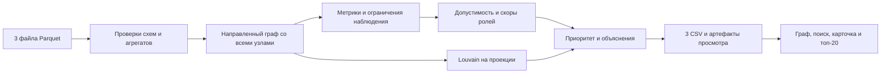

# Граф денег

Локальный инструмент для аналитика: объяснимые гипотезы ролей, кластеры, приоритет проверки
и направленная схема переводов. Данные кейса HackAlem AI, июль 2026. Роли не являются
утверждением о виновности, а скоры — вероятностью нарушения.

## Состояние на 23 сентября 2026

Реализованы P0–P2: загрузка и проверки, полный офлайн-расчёт, три CSV и Streamlit.
Проверки P3 выполнены на реальных данных: 16 тестов, повторяемость CSV и просмотр в Chrome.
Первый исправленный прогон — 3,03 с, повторный — 2,87 с при лимите 300 с (Windows, Python 3.13).
Время импортов в таймер пайплайна не входит; полный запуск команды также занял менее 6 секунд.

## Запуск

Требуется **Python 3.12+**; проверено на Python 3.13. Зафиксированные NumPy, SciPy и NetworkX
требуют минимум 3.12. Данные находятся в data/, исходники организаторов — в starter/.

Windows PowerShell, подготовка окружения:

```powershell
python -m venv .venv
.\.venv\Scripts\python.exe -m pip install -r requirements.txt
```

Один запуск от сырых данных до всех результатов:

```powershell
.\.venv\Scripts\python.exe run.py --data data --out out
```

Экран просмотра:

```powershell
.\.venv\Scripts\python.exe -m streamlit run app.py
```

Открыть http://127.0.0.1:8501. На Linux/macOS вместо `.venv\Scripts\python.exe` использовать
`.venv/bin/python`. В активированном окружении команда расчёта — `python run.py`.
Настройки меняются через `--config config.yaml`. Для другого набора результатов интерфейса
установить переменную GRAPH_OUT_DIR. Обязательный расчёт не использует API и не требует ключей.

`--llm` пока только сообщает об отсутствии ИИ-слоя и выполняет тот же офлайн-расчёт.
Временные паттерны, HITS, cut_risk, чувствительность порогов и ИИ-ассистент пока не реализованы.
Они не имитируются нулями или фиктивными ответами.

### Если Chrome блокирует скачивание CSV

По умолчанию расчёт сохраняет `nodes_roles.csv`, `top_nodes.csv` и `clusters.csv` в `out/`.
Кнопки скачивания в интерфейсе создают дополнительную копию. В боковой панели
«Готовые результаты» → «Где лежат готовые CSV» показан полный путь к папке
на компьютере, где запущено приложение; он учитывает `GRAPH_OUT_DIR`.
При локальном запуске эту папку можно открыть в Проводнике.

Сообщение «Ваша организация заблокировала файл» означает ограничение скачивания
политикой безопасности. Оно не свидетельствует об ошибке расчёта или CSV.
Причину ограничения должен проверить администратор браузера или компьютера:
[Chrome поддерживает блокировку скачивания политиками](https://support.google.com/chrome/a/answer/2657289?hl=ru).
Приложение не меняет настройки защиты браузера.

## Результаты на предоставленных данных

| Проверка | Факт |
|---|---:|
| Узлы / seed | 2 248 / 81 |
| Направленные рёбра / транзакции | 3 119 / 4 840 |
| Оборот наблюдаемой сети | 365 890 012,01 KZT |
| Изолированные узлы, сохранённые в выгрузке | 19 |
| Обрезанные узлы на глубине 4 | 444 |
| Слабосвязные компоненты с изолятами / без | 35 / 16 |
| Крупнейшая компонента / узлы вне неё | 1 877 / 371 |
| Кластеры Louvain / из них с несколькими seed | 88 / 8 |

В ТЗ указано 352 узла вне крупнейшей компоненты: это число получается без 19 изолятов.
Мы сохраняем все узлы, поэтому полное число — 371. Суммы и количество транзакций по каждой
паре совпали с edges. Число 8 — фактический результат, не цель настройки алгоритма.

| Гипотеза роли | Узлов |
|---|---:|
| consolidator | 85 |
| coordinator | 12 |
| distributor | 56 |
| transit | 42 |
| terminal | 472 |
| peripheral | 1 581 |

Нет размеченных ролей, поэтому accuracy не измерялась. Это распределение эвристических
гипотез, а не оценка числа нарушителей. Изменение порогов может изменить результат.

## Артефакты

| Файл в out/ | Содержание |
|---|---|
| nodes_roles.csv | Все gid; обязательные role, role_score, cluster_id, priority_score, evidence |
| clusters.csv | cluster_id, n_nodes, n_seed, sum_kzt_internal, top_gids, hypothesis |
| top_nodes.csv | 20 записей: rank, gid, role, priority_score, why |
| node_features.parquet | Полные метрики, допуски ролей, пять скоров, альтернативы, ограничения и слагаемые приоритета |
| viewer_edges.parquet | Направленные связи из того же прогона |
| run_manifest.json | Конфигурация, хеши входа/выхода, версии, время этапов, диагностика |

Дополнительные поля nodes_roles включают метрики, eligible_*, score_*, best_specialized_role,
role_runner_up, runner_up_score, score_margin, data_limitation, next_request, priority_* и rank.
Неопределённые отношения и средние при нулевом знаменателе остаются пропусками только
в дополнительных полях. Обязательные поля заполнены у всех узлов, evidence ≤200 символов.

Интерфейс проверяет хеши всех артефактов и не открывает смешанные или изменённые результаты.
Всё читается из одного прогона, без повторного расчёта. Ресурсы графа встроены в HTML,
запросов к CDN нет. Большие int64 gid передаются в JavaScript как строки.

## Как считается роль

Обозначим N(x) = min(x / q95, 1), где q95 — 95-й процентиль положительных значений
признака во всей входной выборке. Если положительных значений нет, N(x)=0.
Масштабы нормировки сохранены в run_manifest.json. Это относительная шкала данной выборки.

C — доля суммы от крупнейшего входящего контрагента; R — наблюдаемый out_kzt / in_kzt.
При нулевом входе C и R не определены. Степени — число направленных связей.
Посредничество B — точный нормированный betweenness направленного графа без весов длин:
сумма денег не считается расстоянием. Для большого графа можно задать betweenness_sample.

Сначала проверяются условия допустимости, затем считается балл только допустимых ролей:

| Роль | Условия | Балл |
|---|---|---|
| consolidator | Не seed, не обрыв; вход >0; ≥3 плательщиков; C≤0,75; R≤0,6 | 0,4·N(in_deg)+0,3·(1−C)+0,3·clip(1−R,0,1) |
| distributor | ≥10 получателей, в том числе допустимо для seed | 0,7·N(out_deg)+0,3·N(out_kzt) |
| transit | Не seed, не обрыв; есть вход и выход; 0,8≤R≤1,2 | 0,7·max(0,1−abs(R−1)/0,2)+0,3·N(in_kzt) |
| terminal | Не seed, не обрыв; исходящих 0; вход ≥50 000 KZT; не выполнены условия consolidator | 0,6+0,4·N(in_kzt) |
| coordinator | Не seed; есть вход и выход; depth≥2; достижим от ≥2 seed; N(B)≥0,7 | 0,7·N(B)+0,3·N(n_seed_sources) |
| peripheral | Ни одна допустимая роль не набрала 0,5 | 0 для изолята, иначе 0,49·(1−лучший специальный скор) |

Если максимальный специальный скор ≥0,5, выбирается его роль. Равенства разрешаются
в порядке coordinator, consolidator, distributor, transit, terminal. Специальное правило
сбора с многих имеет приоритет допустимости над общим признаком отсутствия исходящих.
`role_runner_up` — второй специальный кандидат с положительным скором; `none`, если его нет.
Для peripheral отдельно сохраняется лучший специальный кандидат; fallback-скор — не уверенность
в безвредности и не сопоставим с вероятностью. Обоснования порогов находятся в config.yaml.

Достижимость от seed исключает сам seed даже при наличии цикла. Это структурный признак:
он не доказывает, что те же деньги прошли весь путь, и не проверяет временной порядок.

## Кластеры и приоритет

Louvain применяется к неориентированной проекции: встречные суммы складываются; self-loop
не создаёт связь между участниками и исключается из проекции, но сохраняется в оборотах.
Изоляты получают собственный кластер. resolution=1, random_seed=42. Кластеры нумеруются
по убыванию размера, затем по минимальному gid. Внутренний оборот — сумма исходных
направленных рёбер внутри группы, каждое учитывается один раз.

```text
priority = 0,4·role_value + 0,2·N(n_seed_sources)
         + 0,2·N(in_kzt) + 0,2·N(betweenness)
```

Веса ролей: coordinator 1; consolidator 0,9; distributor 0,7; transit 0,5;
terminal 0,4; peripheral 0,1. При равенстве приоритета первым идёт меньший gid.
Все четыре вклада видны в карточке и why. Изолят также имеет минимальный ролевой вклад:
это элемент очереди обзора, не положительный сигнал о нарушении.

## Ограничения и следующий запрос

- Граница depth=4 без исходящих: terminal и признаки удержания запрещены; нужен дозапрос исходящих.
- Входящие seed неполны: балансные роли для них запрещены; нужны полные входящие.
- Любой terminal означает только отсутствие исходящих в этой выборке, не реальный остаток на счёте.
- Видны только внутрибанковские переводы за июль от 5 000 KZT. Мелкие, внешние и более поздние переводы неизвестны.
- Маленькая компонента сама по себе не означает нехватку данных. Изоляты явно помечены.
- Обзор показывает максимум 80 узлов. Поиск любого gid показывает соседей первого колена;
  если их больше лимита, есть уведомление и полный список прямых связей таблицей.
- ИИ, временные признаки, устойчивость к порогам и оценка удаления узлов пока отсутствуют.

## Проверки

```powershell
.\.venv\Scripts\python.exe -m pip install -r requirements-dev.txt
.\.venv\Scripts\python.exe -m pytest -q
.\.venv\Scripts\python.exe run.py --data data --out out-check
```

15 тестов: неверные суммы/количества, неизвестный конец ребра, дубликаты, отсутствующий файл,
цепь, сбор, веер, цикл, seed, обрыв, все изоляты, повторяемость при перестановке входа,
целостность артефактов, отсутствие CDN и сценарии Streamlit. Реальные три CSV повторного
прогона совпали побайтово. Просмотр графа и поиск проверены дополнительно в Chrome.
requirements-lock.txt фиксирует всё установленное окружение, включая тестовые зависимости;
его можно использовать вместо requirements.txt для повторения этой среды.

## Схема



## Масштабирование до миллиона узлов

Текущий NetworkX и точное посредничество предназначены для объёма кейса. При росте:
колоночная обработка DuckDB/Polars, графовый движок igraph/graph-tool, сэмплирование
посредничества, ограничение визуализации окружением узла. Достижимость от многих seed
потребует оптимизации через компоненты сильной связности и пакетные множества достижимости.
Нормировки и глобальные метрики изменяются с сетью: инкрементальные расчёты требуют отдельной
проверки, простое добавление новых рёбер не сохраняет автоматически старые роли.
Это план развития; масштаб на миллионе узлов не тестировался.

Исходное [ТЗ](CASE-TZ.md), [план](PLAN.md), [решения](DECISIONS.md), [задачи](CODEX-TASKS.md).
API алгоритмов сверены с [NetworkX](https://networkx.org/documentation/stable/reference/algorithms/generated/networkx.algorithms.community.louvain.louvain_communities.html),
проверка интерфейса использует [Streamlit AppTest](https://docs.streamlit.io/develop/api-reference/app-testing/st.testing.v1.apptest).
